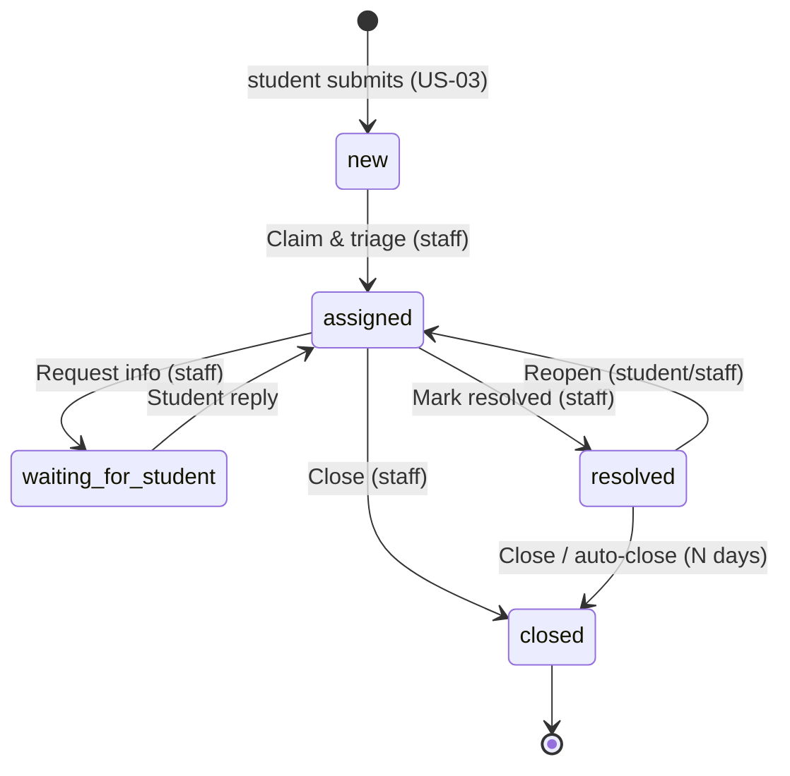
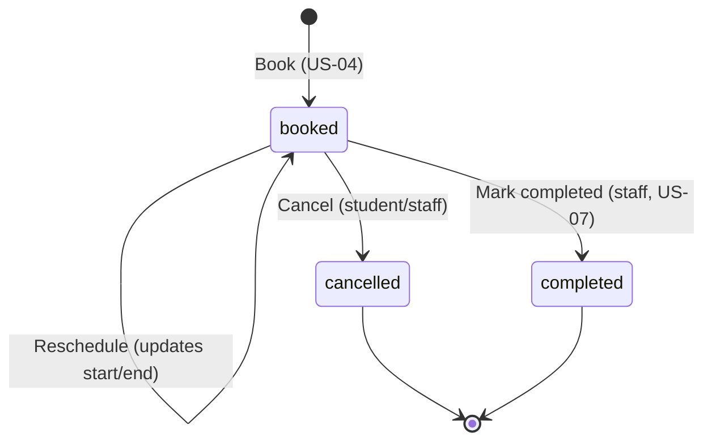

# CampusConnect — Data Model

Source of truth for Firestore collections, fields, denormalization, indexes, and the
roles/claims setup. **Any change here must be paired with a `firestore.rules` change.**

Principles (see `AGENTS.md`): flat and simple; denormalize display names so read-heavy
views never fan out (Firestore has no joins); roles live in **custom claims**, not
documents, so rules stay read-free; status is never written directly — it is the outcome
of a named server action that also appends an `events` audit doc.

---

## Roles & custom claims

Identity is Firebase Auth. Authorization is a single custom claim:

    role: "student" | "advisor" | "admin"

- **onUserCreate** Cloud Function sets `role: "student"` on every new account and creates
  the `users/{uid}` profile doc.
- **setRole** admin-only callable Cloud Function promotes a user to `advisor` or `admin`
  (and can demote). It writes the claim and mirrors `role` onto the profile doc for display.
- Claims are read from the ID token in rules via `request.auth.token.role` — **no document
  read**. A client sees a new role only after a token refresh: force with `getIdToken(true)`.
- `isStaff()` in rules = `role in ["advisor", "admin"]`. `advisor` and `admin` are one
  working tier for ticket work; `admin` additionally gets reporting + role management.
  See ADR-0001.

The `role` field on the profile doc is a **denormalized mirror for display only**; the
claim is authoritative. Rules must never trust the profile `role` for access decisions.

---

## Collection: `users/{uid}`

One doc per account, id = Auth uid.

| Field | Type | Notes |
|---|---|---|
| `uid` | string | mirrors doc id |
| `email` | string | from Auth |
| `displayName` | string | e.g. "Amara Okafor" |
| `initials` | string | e.g. "AO" — precomputed for avatars |
| `role` | string | display mirror of the claim; **not** authoritative |
| `program` | string | student's program, e.g. "MSc International Business" (student only) |
| `title` | string | staff role label, e.g. "Academic Advisor" (staff only) |
| `createdAt` | timestamp | server timestamp |
| `notificationPrefs` | map | per-channel/per-event opt-in, e.g. `{ email: true, push: true, ticketUpdates: true, appointmentReminders: true }` |

### Subcollection: `users/{uid}/notifications/{notificationId}`

In-app notification feed for the user. Written inline (best-effort, after the primary write
succeeds) by the same server action that mutates the related ticket/appointment — **not** by
a Cloud Function trigger, since no Cloud Functions are deployed in this MVP. `firestore.rules`
allows the owning user to create their own notification docs, subject to a closed `type` enum
and required-field check (see US-06 design.md).

| Field | Type | Notes |
|---|---|---|
| `type` | string | `ticket_update` \| `ticket_reply` \| `appointment_booked` \| `appointment_reminder` \| `appointment_cancelled` |
| `title` | string | headline copy |
| `body` | string | detail line |
| `link` | string | in-app route to the related ticket/appointment |
| `read` | boolean | default false |
| `createdAt` | timestamp | for ordering |
| `refId` | string | id of the related ticket/appointment |

### Subcollection: `users/{uid}/fcmTokens/{token}`

Registered FCM device tokens for push. Doc id = the token.

| Field | Type | Notes |
|---|---|---|
| `token` | string | mirrors doc id |
| `createdAt` | timestamp | for pruning stale tokens |
| `userAgent` | string | optional, for debugging |

---

## Collection: `tickets/{ticketId}`

A support request. Human-facing code (e.g. `#REQ-2041`) is stored as `code`; `ticketId`
is the Firestore id.

| Field | Type | Notes |
|---|---|---|
| `code` | string | display code, e.g. `REQ-2041` |
| `title` | string | short summary |
| `description` | string | student's detail |
| `category` | string | `registration` \| `records` \| `financial_aid` \| `advising` \| `it` \| `other` (labels in design-brief) |
| `priority` | string | `high` \| `medium` \| `low` |
| `status` | string | `new` \| `assigned` \| `waiting_for_student` \| `resolved` \| `closed` |
| `studentId` | string | Auth uid of requester |
| `studentName` | string | **denormalized** |
| `assigneeId` | string \| null | staff uid, null until claimed |
| `assigneeName` | string \| null | **denormalized** |
| `createdAt` | timestamp | server timestamp |
| `updatedAt` | timestamp | bumped on every action |
| `lastActorName` | string | **denormalized**, who last touched it |
| `lastMessageAt` | timestamp | drives "Updated 2h ago" and auto-close timer |
| `resolvedAt` | timestamp \| null | set on Mark resolved; basis for auto-close |
| `nextAction` | string \| null | short staff-facing note ("Confirm hold with Records"); shown on the triage board, **never** to the student |
| `rating` | number \| null | student satisfaction 1–5, captured after resolution; feeds the admin satisfaction KPI (may be seeded for the MVP) |

Status is set **only** by named server actions (see workflow below). Students create
tickets with `status: "new"` and never set any other status directly.

**Status display labels** differ by audience — the stored value is canonical; the UI maps it:

| stored `status` | student sees | staff sees |
|---|---|---|
| `new` | New | New |
| `assigned` | In progress | Assigned |
| `waiting_for_student` | Waiting for you | Waiting for student |
| `resolved` | Resolved | Resolved |
| `closed` | Closed | Closed |

**Categories** — canonical value → student label / staff label:
`registration` → "Registration & holds" / "Academic"; `records` → "Records & transcripts" /
"Records"; `financial_aid` → "Financial aid" / "Finance"; `advising` → "Advising & planning" /
"Advising"; `enrollment` → "Course & enrollment" / "Academic"; `it` → "Technical support" /
"IT Support"; `career` → "Career" / "Career"; `other` → "Other". Store the canonical value;
render the label per audience.

### Subcollection: `tickets/{ticketId}/events/{eventId}`

Append-only audit + conversation log. Every status transition and every reply writes one.

| Field | Type | Notes |
|---|---|---|
| `type` | string | `created` \| `claimed` \| `message` \| `info_requested` \| `student_reply` \| `internal_note` \| `resolved` \| `closed` \| `reopened` \| `reassigned` |
| `visibility` | string | `public` (student + staff) \| `internal` (staff only). **`internal_note` is always `internal`; the student can never read it** — enforce in rules and query filters. |
| `fromStatus` | string \| null | status before (null for non-transition events) |
| `toStatus` | string \| null | status after |
| `actorId` | string | uid who performed the action |
| `actorName` | string | **denormalized** |
| `actorRole` | string | `student` \| `advisor` \| `admin` at time of action |
| `message` | string | note / reply / request-info text (optional for pure transitions) |
| `createdAt` | timestamp | ordering |

A staff **Reply to student** writes a `message` (visibility `public`) and, per the design,
moves the ticket `assigned → waiting_for_student`. An **Internal note** writes an
`internal_note` (visibility `internal`) with no status change. The student's Track Ticket
view must query `visibility == "public"` only.

---

## Collection: `appointments/{appointmentId}`

A one-to-one advising slot booked by a student with an advisor.

| Field | Type | Notes |
|---|---|---|
| `service` | string | `academic_advising` \| `financial_aid` \| `career` \| … (labels in design-brief) |
| `title` | string | e.g. "Career planning session" |
| `studentId` | string | Auth uid |
| `studentName` | string | **denormalized** |
| `advisorId` | string | staff uid |
| `advisorName` | string | **denormalized** |
| `start` | timestamp | slot start |
| `end` | timestamp | slot end |
| `mode` | string | `in_person` \| `video` \| `phone` |
| `location` | string | room or meeting link |
| `status` | string | `booked` \| `cancelled` \| `completed` |
| `notes` | string | student's note to advisor (optional) |
| `createdAt` | timestamp | server timestamp |

Advisor availability for the booking flow may be modeled later; for the MVP, treat
bookable slots as generated/seeded (see design-brief booking flow).

---

## Composite indexes (expected)

Firestore requires composite indexes for these query shapes; declare them in
`firestore.indexes.json` as the queries are built:

- `tickets` — `studentId ==` + `updatedAt desc` (student's request list).
- `tickets` — `assigneeId ==` + `status ==` + `updatedAt desc` (staff "my queue").
- `tickets` — `status ==` + `priority` + `updatedAt desc` (triage board lanes).
- `appointments` — `studentId ==` + `start asc` (student upcoming/past).
- `appointments` — `advisorId ==` + `start asc` (advisor schedule).
- `users/{uid}/notifications` — `read ==` + `createdAt desc` (unread feed).

---

## Ticket status workflow

Every ticket transition also appends an `events` audit doc (see the subcollection above).

- **Claim & triage** (staff): `new → assigned`, sets `assigneeId`/`assigneeName`, may set priority.
- **Request info** (staff): `assigned → waiting_for_student`, requires a message.
- **Student reply**: `waiting_for_student → assigned`, appends `student_reply`.
- **Mark resolved** (staff): `assigned → resolved`, sets `resolvedAt`.
- **Reopen** (student or staff): `resolved → assigned`.
- **Close** (staff): `resolved → closed` (terminal). Also `assigned → closed` allowed for staff.
- **Auto-close** (scheduled function): `resolved → closed` after N days with no reply.

The allowed set lives as a `{ from: [...] }` map inside the transition server action; the
action validates `from` includes the current status, writes the new status + audit event
atomically, and denormalizes `lastActorName`. See ADR-0002.

## Appointment status workflow

- **Book** (student): create with `status:"booked"` (US-04).
- **Reschedule** (student): updates `start`/`end`, stays `booked`.
- **Cancel** (student or staff): `booked → cancelled` (terminal).
- **Mark completed** (staff): `booked → completed` (terminal) — deferred to US-07 (ADR-0005).

Unlike tickets, appointments have **no `events` subcollection** — transitions are plain field
updates guarded by the same `{ from: [...] }` map in the server action (`lib/actions/appointments.ts`),
with no audit doc.
